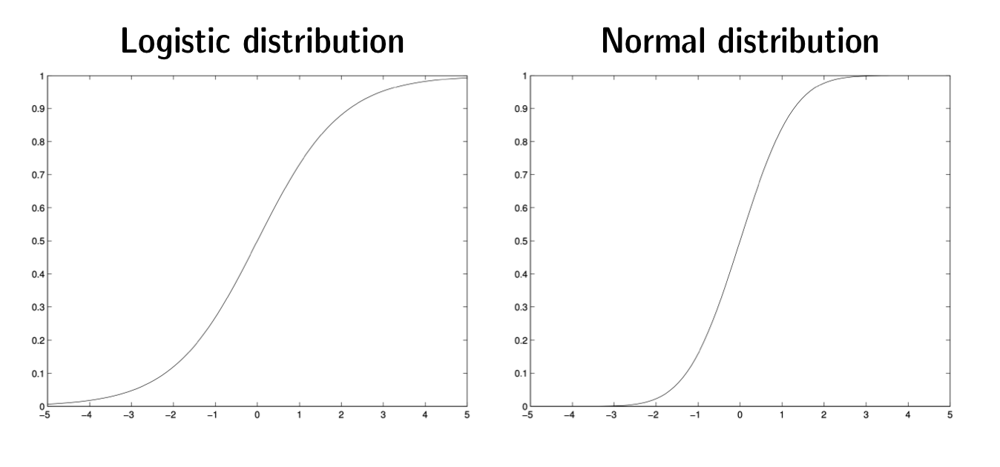

# 1 Time Series Analysis

## 1.1 Classical Regression Models

Variation in a time series has different sources (components):

-   **trend** $\mu_{t}$: long term change of the mean level of the series

-   **seasonal component** $s_{t}$: regular fluctuations with annual period

-   **cycle** $c_{t}$: non-seasonal oscillations, e.g. business cycles

-   **irregular component (or residual)** $u_{t}$: irregular fluctuations which remain when all other components have been removed

### Classical decomposition model:

-   $Y_{t}=\mu_{t}+s_{t}+c_{t}+u_{t}$ (additive components)

-   $Y_{t}=e^{\mu_{t}} \cdot e^{s_{t}} \cdot e^{c_{t}} \cdot e^{u_{t}}$ (multiplicative)

-   $\log Y_{t}=\mu_{t}+s_{t}+c_{t}+u_{t}$ (multiplicative transformed into additive)

### Modeling components

-   **Global model**: $Y_{t}=\mu+u_{t}$. Estimation: $\hat{\mu}=\bar{y}=\frac{1}{T} \sum_{t=1}^{T} y_{t}$

-   **Local model**: $Y_{t}=\mu_{t}+u_{t}$. Estimation: $\hat{\mu}_{t}=\frac{1}{2 q+1} \sum_{i=-q}^{q} y_{t+i}$

-   **Trend model**: $\mu_{t}=\beta_{0}+\beta_{1} t+\cdots+\beta_{p} t^{p}$. Multi-step ahead forecast: $\begin{array}{l}\mathbb{E}\left(Y_{t+s} \mid Y_{t}\right)=\hat{\beta}_{0}+(t+s) \hat{\beta}_{1} \\\mathbb{V}\left(Y_{t+s} \mid Y_{t}\right)=\sigma_{u}^{2}\end{array}$

-   **Seasonal model:**

    -   **Modeling seasonal effects Approach 1: *deterministic seasonal pattern*** $y_{t}=s_{t}+u_{t}$***\
        *** $\delta_{j}$ denotes the level in season j (j = 1,...,p) $s_t$ repeats the same fixed seasonal pattern with period p: $\left(\delta_{1}, \ldots, \delta_{p}, \delta_{1}, \ldots, \delta_{p}, \delta_{1}, \ldots, \delta_{p}, \ldots\right)$\
        Estimation: $s_{t}=\delta_{1} D_{t, 1}+\cdots+\delta_{p} D_{t, p}$ No **constant** allowed since $\sum_{j=1}^{p} D_{t, j}=1$!

    -   **Modeling seasonal effects Approach 2: *deviations from the level*** $y_{t}=\mu+\tilde{s}_{t}+u_{t}$\
        Define a global mean $\mu$ and seasonal deviations from the global mean $\gamma_{j}=\delta_{j}-\mu$ for j = 1,...,p which sum up to zero. One of the seasonal deviation is determined given all the others. Hence, the entire seasonal pattern depends only on p-1 unknown values.\
        Estimation: $\tilde{s}_{t}=\gamma_{1}\left(D_{t, 1}-D_{t, p}\right)+\cdots+\gamma_{p-1}\left(D_{t, p-1}-D_{t, p}\right)$ **Constant** (or deterministic trend) **required**!

    -   **Combined seasonal trend model** $y_{t}=\mu_{t}+\tilde{s}_{t}+u_{t}$

#### Durbin-Watson statistic

$$
d=\frac{\sum_{t=2}^{T}\left(\hat{u}_{t}-\hat{u}_{t-1}\right)^{2}}{\sum_{t=1}^{T} \hat{u}_{t}^{2}}
$$

If there is no serial correlation, the Durbin-Watson statistic will be around 2. In large samples the test statistic $d$ is approximately equal to $2(1 - r_1)$.

-   If autocorrelation at lag 1 is **positive**, then $0 \leq d < 2$.

-   If autocorrelation at lag 1 is **negative**, then $2 < d \leq 4$.

## 1.2 Stochastic Processes

At time t, the process $Y_t$ varies with probability $1-\alpha$ within the interval

$$[\mu_t -c_{\alpha/2}\sigma_t,\mu_t +c_{1-\alpha/2}\sigma_t],$$ where $c_p$ is the p-quantile of the marginal distribution of $(Y_t - \mu_t )/\sigma_t$.

### Stationarity

A stochastic processes is called **weakly stationary** (second order stationary), if the second moments of $Y_t$ exist and

-   the (marginal) mean is constant over time: $\mathbb{E}\left(Y_{t}\right)=\mu_{t}=\mu$

-   the (marginal) variance is constant over time: $\mathbb{V}\left(Y_{t}\right)=\sigma_{t}^{2}=\sigma^{2}$

-   the autocovariance function $Cov(Y_t,Y_s)$ depends only on the lag $h=t-s$.

**Clues for stationarity**

-   Is the mean and variance constant?

-   If the time is reversed, does the time series plot look similar to the original one?

-   Do autocorrelations decline quickly in the empirical autocorrelogram?

### The empirical autocorrelation function at lag h $$r_{h}=\frac{\frac{1}{T} \sum_{t=h+1}^{T}\left(y_{t-h}-\bar{y}\right)\left(y_{t}-\bar{y}\right)}{\frac{1}{T} \sum_{t=1}^{T}\left(y_{t}-\bar{y}\right)^{2}}$$

### A white noise process

$$
\begin{aligned}\mathbb{E}\left(Y_{t}\right) &=0, \quad \mathbb{V}\left(Y_{t}\right)=\sigma^{2} \\\rho(h) &=\left\{\begin{array}{ll}1 & \text { for } h=0 \\0 & \text { for } h=\pm 1, \pm 2, \ldots\end{array}\right.\end{aligned}
$$

(Always stationary. There are empirical autocorrelations $r\_{h}\neq0$ for some $h\geq1$ because of estimation error )

### Box-Ljung-Statistics

$$
Q(h)=T(T+2) \sum_{k=1}^{h} \frac{r_{k}^{2}}{T-k}
$$

The Box-Ljung-Statistic does not assess single autocorrelations but aggregates all autocorrelations $r_1,...,r_h$ up to lag *h.*

**Null hypothesis**: no autocorrelation up to lag h.\
**Alternative hypothesis**: there exists at least one $r_h$ that is different from zero.

## 1.3 Stationary Models: ARMA Models

Classical Regression models often violate the assumption that residuals are uncorrelated. With ARMA processes we try to solve this problem.

### Non-zero mean stationary AR(1) Process

$$
Y_{t}-\mu=\phi\left(Y_{t-1}-\mu\right)+u_{t}, \quad \mathbb{E}\left(u_{t} \mid Y_{t-1}\right)=\mu, \quad \mathbb{V}\left(u_{t}\right)=\frac{\sigma_{u}^{2}}{1-\phi^{2}}
$$ $$
\mathbb{E}\left(Y_{t} \mid Y_{t-1}\right)=\mu+\phi\left(Y_{t-1}-\mu\right)\quad\mathbb{V}\left(Y_{t} \mid Y_{t-1}\right)=\sigma_{u}^{2}
$$

| $|\phi| < 1$ | $\phi = 0$          | $\phi = 1$  | $|\phi|>1$        |
|--------------|---------------------|-------------|-------------------|
| stationary   | white noise process | random walk | explosive process |

### Autocorrelation function (ACF) of an AR(1) Process at lag h

### $$\begin{aligned}\rho(1)&=\phi\\\rho(h)&=\phi^{h}\end{aligned}$$

AR(1) estimation, diagnostics, forecasting

$$
y_{t}=\mu(1-\phi)+\phi y_{t-1}+u_{t}\\u_{t}=Y_{t}-\phi Y_{t-1}-\mu(1-\phi)
$$

Innovations $u_t$ are assumed to be a white noise process $\Longrightarrow$ check ACF and Box-Ljung statistic!

Point forecast k steps ahead and associated uncertainty:

$$
\begin{array}{l}\mathbb{E}\left(Y_{t+k} \mid Y_{t}\right)=\phi^{k} Y_{t}+\left(1-\phi^{k}\right) \mu \\\mathbb{V}\left(Y_{t+k} \mid Y_{t}\right)=\left(1-\phi^{2 k}\right) \sigma^{2}, \quad \sigma^{2}=\sigma_{u}^{2} /\left(1-\phi^{2}\right)\end{array}
$$

As long as stationarity holds, with increasing forecasting horizon *k*, the point forecast converges to the long run level $\mu$ and the associated uncertainty approaches the stationary / unconditional variance $\sigma^2$. The closer $|\phi|$ to 0, the quicker the distribution $Y_{t+k} \mid Y_{t}$ converges to stationary distribution / unconditional distribution.

95% interval forecasting using the standard deviation $\operatorname{SD}\left(Y_{t+k} \mid Y_{t}\right)=\sqrt{\mathbb{V}\left(Y_{t+k} \mid Y_{t}\right)}$

$$
\left[\mathbb{E}\left(Y_{t+k} \mid Y_{t}\right)-1.96 \times \mathrm{SD}\left(Y_{t+k} \mid Y_{t}\right), \mathbb{E}\left(Y_{t+k} \mid Y_{t}\right)+1.96 \times \mathrm{SD}\left(Y_{t+k} \mid Y_{t}\right)\right]
$$

### Autoregressive/AR(p) Processes

$$
Y_{t}=\phi_{1} Y_{t-1}+\phi_{2} Y_{t-2}+\cdots+\phi_{p} Y_{t-p}+u_{t}
$$

Not necessarily stationary!

### **Partial autocorrelation function (PACF) of an AR(p) process at lag h**

$$\begin{aligned}
\pi(h)=&\phi_{h h}\\Y_{t}=\phi_{h 1} Y_{t-1}+\cdots+&\phi_{h h} Y_{t-h}+u_{t}\\
\\pi(h)\left\{\begin{array}{ll}=1 & h=0 \\\neq 0 & 1 \leq h \leq p \\=0 & h>p\end{array}\right.
\end{aligned}$$

### Moving average (MA) Processes

$$
Y_{t}=\theta_{1} u_{t-1}+\theta_{2} u_{t-2}+\cdots+\theta_{q} u_{t-q}+u_{t}\quad\mathbb{E}(Y_{t})=0\quad\mathbb{V}(Y_{t})=\sigma_{u}^{2}(1+\sum_{i=1}^{q} \theta_{i}^{2})$$ $$\rho(h)\left\{\begin{array}{ll}\quad1 & h=0 \\\frac{\sum_{i=0}^{q-h} \theta_{i} \theta_{i+h}}{\sum_{i=0}^{q} \theta_{i}^{2}} &1 \leq h \leq q \\\quad0 & h>q\end{array}\right.\\Cov(Y_t,Y_{t-1})=\theta \sigma_{u}^{2}
$$

$Y_t$ is described as weighted sum of the actual and past errors (shocks). The MA(1) process is always stationary. For $\theta=0$, the process reduces to a white noise process.

| Process | ACF                  | PACF                 |
|---------|----------------------|----------------------|
| MA(q)   | cuts off at lag q    | decays geometrically |
| AR(p)   | decays geometrically | cuts off at lag p    |

: Identification of AR and MA Processes

### ARMA Processes

$$
Y_{t}=\phi_{1} Y_{t-1}+\phi_{2} Y_{t-2}+\cdots+\phi_{p} Y_{t-p}+\theta_{1} u_{t-1}+\theta_{2} u_{t-2}+\cdots+\theta_{q} u_{t-q}+u_{t}
$$

An ARMA model may be regarded as a multiple regression model where the past observations and the past errors (shocks, innovations which we cannot observe directly) act as predictors. An ARMA process is stationary iff the AR part defines a stationary process. The mean of the ARMA process is zero. An ARMA process with mean $\mu$ is obtained by assuming that the process $Y_t-\mu$ follows the zero-mean ARMA process. **For ARMA processes, ACF and PACF both decay geometrically - the order cannot be determined from ACF and PACF**.

\newpage

### Non-Linear Least Squares (NLS) Estimation

$$\begin{aligned}
\hat{y}_{t}(\boldsymbol{\beta})&=\tilde{\beta}_{0}+\phi_{1} y_{t-1}+\cdots+\phi_{p} y_{t-p}+\theta_{1} u_{t-1}+\cdots+\theta_{q} u_{t-q}\\\hat{u}_{t}(\boldsymbol{\beta})&=y_{t}-\hat{y}_{t}(\boldsymbol{\beta})
\end{aligned}$$

As for OLS, the aggregated prediction error is determined as the sum of squared residuals, but the estimation problem is nonlinear, because the first derivative $-\hat{u}_{t-1}(\boldsymbol{\beta})-\theta_{1} \frac{d}{d \theta_{1}} \hat{u}_{t-1}(\boldsymbol{\beta})$ depends on $\boldsymbol{\beta}$ (for an ARMA(1,1) model here).

**Properties of the NLS estimator for large T:**

-   **Asymptotic unbiasedness**: The estimation errors $\mathbb{E}\left(\hat{\phi}_{i}\right)-\phi_{i}$ and $\mathbb{E}\left(\hat{\theta}_{i}\right)-\theta{i}$ converge to zero.

-   **Asymptotic normality**: The estimation errors scaled by $\sqrt{T}$ converge to a normal distribution with standard errors depending on $\boldsymbol{\beta}$.

-   **Asymptotic efficiency**: No other asymptotically unbiased estimator has smaller standard errors for large T.

-   **Consistency**: The standard errors go to zero for $T \rightarrow \infty$, hence the estimator $\hat{\boldsymbol{\beta}}$ approaches the true value $\boldsymbol{\beta}$ with probability one.

### Model Selection

-   Use overfitting and hypothesis testing (T needs to be large in order to rely on standard errors)

-   Residual diagnostics (here especially ACF and PACF)

-   Model choice criteria\
    $$\begin{aligned}A I C &=\log (\mathrm{SSR})+2 \cdot k \\SC/BIC &=\log (\mathrm{SSR})+\log n \cdot k \\H Q &=\log (\mathrm{SSR})+2 \log (\log (n)) \cdot k\end{aligned}$$

### Residual Diagnostics

-   Specification check: Residual plot

-   Autocorrelation check: Empirical correlogram and Box-Ljung statistics

-   Heteroskedasticity check: Squared residuals plot

-   Normality check: Histogram, Jarque-Bera statistic

### Modelling strategies for non-stationary time series

1.  **Autocorrelated errors** $\tilde{U}_{t}$ **can be modeled as a stationary ARMA(p, q) process**

    $$
    \tilde{U}_{t}=\phi_{1} \tilde{U}_{t-1}+\phi_{2} \tilde{U}_{t-2}+\cdots+\phi_{p} \tilde{U}_{t-p}+\theta_{1} u_{t-1}+\theta_{2} u_{t-2}+\cdots+\theta_{q} u_{t-q}+u_{t}\\
    \tilde{U}_{t}=\tilde{U}_{t}(\boldsymbol{\beta})=Y_{t}-\left(\beta_{0}+\beta_{1} X_{t, 1}+\cdots+\beta_{k} X_{t, k}\right)
    $$

    Trend model with ARMA(1,1) errors:\
    $$Y_{t}=\beta_{0}+\beta_{1} t+\phi_{1}\left(Y_{t-1}-\left(\beta_{0}+\beta_{1}(t-1)\right)\right)+\theta_{1} u_{t-1}+u_{t}$$

2.  **Random walk and random walk with drift**

    $$
    Y_{t}=Y_{t-1}+\delta+u_{t}\\\mathbb{E}\left(Y_{t} \mid Y_{0}\right)=Y_{0}+t \delta, \quad \mathbb{V}\left(Y_{t} \mid Y_{0}\right)=t \sigma_{u}^{2}
    $$

3.  **Differencing**

    $$
    \Delta Y_{t}=Y_{t}-Y_{t-1}
    $$

    For a random walk process with drift:

    $$
    \Delta Y_{t}=Y_{t}-Y_{t-1}=\delta+u_{t}
    $$

4.  **ARIMA(p, 1, q) processes:** Model $\mu_t$ in above process of first difference as ARMA(p, q) process.

## 1.4 Nonstationary Models

# 2 Discrete and Limited Dependent Variables

A **binary variable** only takes on the value 0 or 1. A **count variable** takes on only a natural number including 0. An **ordered categorical variable** takes on one of K values in K categories that are ordered (categories are not equal distance!).

## 2.1 Regression Models for Count Data

### Problems with the standard linear regression model with dependent count variable

-   Y always must be an integer, but we get other values in between instead

-   **Heteroskedasticity** in the residual u, because of the above

-   Prediction may lead to negative values

### Problem with using log Y as dependent variable

-   We now force positive values, but it can not be applied if any of the observed counts are equal to 0

-   Y always must be an integer, but we get other values in between instead

### The (non-linear) Quasi-Normal Model

$$
\mathbb{E}\left(Y \mid X_{1}, \ldots, X_{K}, \boldsymbol{\beta}\right)=\exp \left(\beta_{0}+\beta_{1} X_{1}+\ldots+\beta_{K} X_{K}\right)
$$

-   We model the log of the expected value of Y which implies a positive expected value

-   To interpret the binary coefficients, the relative change is $\frac{\mathbb{E}\left(Y \mid X_{j}=1, \ldots\right)-\mathbb{E}\left(Y \mid X_{j}=0, \ldots\right)}{\mathbb{E}\left(Y \mid X_{j}=0, \ldots\right)}=e^{\beta_{j}}-1\approx\beta_{j}$

    The relative change in a continues coefficient is $\left(\frac{\partial \mathbb{E}\left(Y \mid X_{j}=x_{j}, \ldots\right)}{\partial x_{j}} \Delta_{x}\right) / \mathbb{E}\left(Y \mid X_{j}=x_{j}, \ldots\right)=\beta_{j} \Delta_{x}$

-   Uses non-linear least squares to find the optimal estimate or Maximum-likelihood estimation.

-   For model comparison we penalize models that are too complex (AIC: m=2, SC/BIC: m=log(n))

    $$
    n \cdot \log (\mathrm{SSR} / n)+n+n \cdot \log (2 \pi)+m \cdot \text { Number of parameters }
    $$

### Poisson model

In a standard regression model we assume our $Y_i$ come from a normal distribution defined by the mean $\mu$ and variance $\sigma^2$. In the Poisson model we instead assume a Poisson distribution which is a standard distribution that is entirely defined by its mean $\mu$.

$$
\begin{array}{l}f(y)=\frac{\mu^{y}}{y !} e^{-\mu}, \quad y \in\{0,1,2, \ldots\} \\\mathbb{E}(Y)=\mathbb{V}(Y)=\mu .\end{array}
$$

### Maximum Likelihood Estimation

ML tries to maximize the likelihood that our observed $Y_i$ came from a certain distribution. For computational reasons, we actually maximize the *log*-likelihood, but the result will be the same. If no predictors are present, then the ML estimator $\hat{\beta}_{0}$ is available in closed form and equal to the log of the average of all $y_{i}$:

$$
\log L\left(\beta_{0}\right)=\sum_{i=1}^{N}\left\{y_{i} \beta_{0}-\exp \left(\beta_{0}\right)\right\}=\beta_{0}\left(\sum_{i=1}^{N} y_{i}\right)-N \exp \left(\beta_{0}\right)$$$$\Longrightarrow\beta_{0}=\log \left(\frac{1}{N} \sum_{i=1}^{N} y_{i}\right)$$

If predictors are present, we need to use an iterative process instead to find the estimator that maximizes log-likelihood.

**Standard errors and t-statistics:**

$$
\operatorname{se}\left(\hat{\beta}_{1}\right)^{2}=\left.\left(\frac{d^{2} \log L\left(\beta_{1}\right)}{d \beta_{1}^{2}}\right)^{-1}\right|_{\beta_{1}=\hat{\beta}_{1}}\quad t_{j}=\frac{\hat{\beta}_{j}}{\operatorname{se}\left(\hat{\beta}_{j}\right)}
$$

**Model selection:** we can use log likelihood to compare across all different models.

### Negative Binomial model

The poisson distribution assumes that distributions with larger mean can take on larger variance. If the variance is actually different from the mean, we have over- or underdispersion in our data and the NB-model is more appropriate, where we assume that

$$
\mathbb{V}(Y)=\mathbb{E}(Y)\left(1+\eta^{2} \mathbb{E}(Y)\right).
$$

For $\eta\rightarrow0$, the NB distribution converges to the Poisson distribution.

\newpage

## 2.2 Linear Probability Model

The "naive" approach to modeling binary outcomes is to use a standard linear regression an use the fact that $\mathbb{E}(Y)=0 \cdot \mathbb{P}(Y=0)+1 \cdot \mathbb{P}(Y=1)=\mathbb{P}(Y=1)$.

$$
Y=\beta_{0}+\beta_{1} X_{1}+\ldots+\beta_{K} X_{K}+u, \quad \mathbb{E}\left(u \mid X_{1}, \ldots, X_{K}\right)=0
$$

Which means that, because of$$
\mathbb{P}\left(Y=1 \mid X_{1}=0, \ldots, X_{K}=0, \beta\right)=\beta_{0},
$$

$\beta_0$ is the conditional probability of Y being 1, given that all regressors are 0. If $X_j$ is a binary variable, then $\beta_j$ is the change in probability from the baseline if its value is 1 rather than 0. If we have interval variables in our model (like *age*) then we often adjust the baseline to the median to make interpretation easier.

The problem with the linear assumption of this model is that it will produce forecasts that lie outside of the interval [0,1]. Also, assumptions about the error term are violated namely that the error is uncorrelated with the level of X (heteroskedasticity) and that it is normally distributed. That's why we use the Logit/Probit models instead.

## 2.3 Binary models

The logit models uses the fact that the odds ratio is larger than 1 if outcome $\mathbb{P}(Y=1)$ is more likely (and vice versa) and that the log function is negative for values $<1$ and positive for values $>1$. $$\mathbb{P}\left(Y=1 \mid X_{1}, \ldots, X_{K}, \beta\right)=\frac{e^{\beta_{0}+\beta_{1} X_{1}+\ldots+\beta_{K} X_{K}}}{1+e^{\beta_{0}+\beta_{1} X_{1}+\ldots+\beta_{K} X_{K}}}=G\left(\beta_{0}+\beta_{1} X_{1}+\ldots+\beta_{K} X_{K}\right)$$

$G(z)=e^{z} /\left(1+e^{z}\right)$ the cumulative distribution function (CDF) of the so-called logistic distribution (hence the name). The inverse transformation function $z=G^{-1}(\mathbb{P}(Y=1))$ lies between $-\infty$ and $\infty$. The probit model substitutes the CDF of the logistic distribution with the cdf of the **standard normal distribution** as function $G(z)$**.** Different data might fit better to either of the two distributions. We use Maximum Likelihood to get an estimate for $\boldsymbol{\beta}$ that maximizes log-likelihood.

### Understanding the Coefficients in the Binary Models

The only thing we can interpret from the summary table of the R output is the sign of an estimated coefficient (the sign will be the same for a Probit and Logit model). A positive coefficient means that the probability increases with that variable, c.p., and vice versa. Because the CDF is non-linear, *the effect of one variable depends on the level of all other variables*. All coefficients need to be taken together (for specific $X$) and applied to the cumulative distribution function $G(z)$ to get the true absolute probability.

We can get to a ceteris paribus interpretation of our model estimates by taking the difference between two forecasts, where we only change the value of our variable of interest. The difference is the change in probability if we change the variable (for the given levels of all parameters).

$\beta_0$ (Intercept): the conditional probability if we set all regressors to zero on a transformed scale.\
$\beta_j$ (dummy variable, K=1): the effect (of $X_1$ here) is given by the difference in the expected values $G\left(\beta_{0}+\beta_{1}\right)-G\left(\beta_{0}\right)$.\
$\beta_j$ (dummy variable, K\>1): the effect is given by the difference in the expected values $G\left(\beta_{0}+\beta_{1}+\beta_{2} X_{2}+\ldots\right)-G\left(\beta_{0}+\beta_{2} X_{2}+\ldots\right)$.

If $\beta_j$ is an interval variable, remember that we sometimes center a variable around the median. A positive sign then means that probability increases for values above the median. The absolute effect of changing $X_j=x_j$ by $\Delta_x$, while holding all other variables fixed, depends on the level of all variables:

$$
\Delta \mathbb{P}\left(Y=1 \mid X_{j}=x_{j}, \cdot\right)=\Delta_{\times} g\left(\beta_{0}+\beta_{1} x_{1}+\ldots+\beta_{K} x_{K}\right) \beta_{j}
$$

$g$ here is the first derivative of the CDF i.e. the density function of the CDF. Because these will be different for the Logit and Probit model, Probit estimates should be multiplied by $4/\ sqrt{2\pi}\approx 1.4$ to compare them with the Logit estimate (this only works sometimes).

The ratio of two partial effects is independent of the level of the variables: $$\frac{\beta_{j}}{\beta_{k}}=\frac{\partial \mathbb{P}\left(Y=1 \mid X_{j}=x_{j}, \cdot\right) / \partial x_{j}}{\partial \mathbb{P}\left(Y=1 \mid X_{k}=x_{k}, \cdot\right) / \partial x_{k}}$$

i.e. if $\beta_j > \beta_k$ , then the effect of changing $X_j$ by 1 is $\beta_j/\beta_k$ times larger than the effect of changing $X_k$ by 1.

### Econometric Inference for Binary Models

**The Likelihood Ratio Statistic (for testing more than one coefficient)**

$$
L R=2\left(\log L_{u}-\log L_{0}\right)
$$

If *q* coefficients are being tested, LR follows asymptotically a $\chi^2_q$-distribution. The idea is to exclude one parameter and compare its log likelihood to the unrestricted model.

**Model comparison**

Once more for model comparison we penalize models that are too complex (AIC: m=2, SC/BIC: m=log(Number of parameters)):

$$
-2 \log L+m \cdot \text { Number of parameters }
$$
