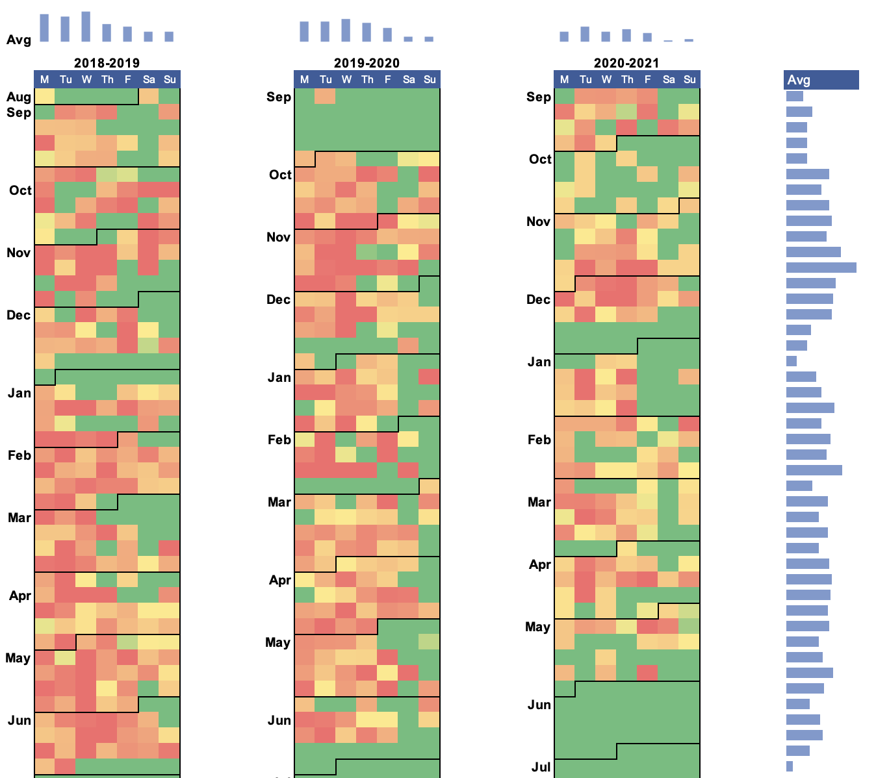
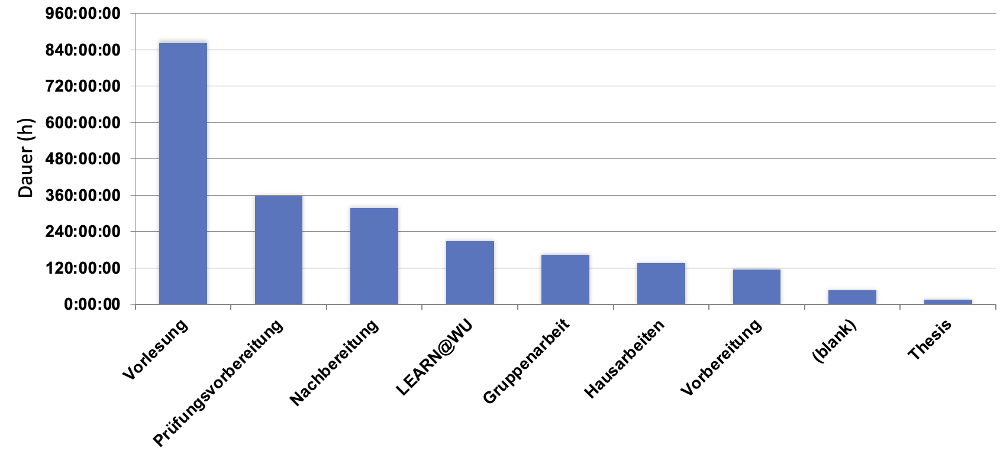

```{r setup, include=FALSE}
library(car)
library(forecast)
library(apsrtable)
library(lmtest)
library(lubridate)
library(dplyr)
library(aod)
library(MASS)
library(corrplot)

knitr::opts_chunk$set(echo = FALSE, warning = FALSE)

weeks <- read.csv("weeks.csv", sep=";", dec=",")
weeks$Week <- dmy(weeks$Week)
weeks$Duration <- as.numeric(hms(weeks$Duration))/3600 # duration in hours
weeks$Weight.c <- weeks$Weight - 78.73 # mean-centered
weeks$HR.c <- weeks$HP - 74.32 # mean-centered
weeks$Sunny <- ifelse(weeks$Sun>41.55, 1, 0)

classes <- read.csv("classes.csv", sep=";", dec=",")
classes$Duration <- as.numeric(hms(classes$Sum.of.Duration))/3600 # duration in hours

entries <- read.csv("entries.csv", sep=";", dec=",")
entries$Duration <- as.numeric(hms(entries$Duration))/3600 # duration in hours

tags <- read.csv("tags.csv", sep=";", dec=",")
tags$Duration <- as.numeric(hms(tags$SumDuration))/3600 # duration in hours


```

# Einführung

## Ausgangsdaten

-   Jan studiert seit WS 2018 BaWiso an der WU
-   Sekundengenaue Zeiterfassungsdaten von 27.8.2018-28.5.2021
-   Kategorisiert nach LV und Art der Lernaktivität (z.B. "Gruppenarbeit", "Prüfungsvorbereitung")
-   1153 Observationen


------------------------------------------------------------------------

## Forschungsfrage

-   Lässt sich die Lernleistung erklären/vorhersagen?

    

------------------------------------------------------------------------

## Summary statistics

-   Dauer aller Studienaktivitäten: `r round(sum(entries$Duration), digits=2)` Stunden

-   Mean (pro Woche): `r format(mean(na.omit(weeks$Duration)), digits=2)` Stunden. SD: `r format(sd(na.omit(weeks$Duration)), digits=2)`

-   Extremwerte: 12h 40m 39s (14.11.2018)

-   Gruppiert nach Art der Aktivität:\
    \

    

------------------------------------------------------------------------

# Zeitreihenanalyse

-   Abhängige Variable: Wöchentliche Studienaktivität (h)
-   Klassisches Regressionsmodel mit Trend

```{r, echo=FALSE}
ts_weeks <- ts(weeks, frequency = 52, start = c(2018, 35)) # wöchentliche Daten
trend_model <- tslm(Duration ~ trend, data=ts_weeks)

#summary(trend_model)


```

```{r, results='asis', echo=FALSE}
apsrtable::apsrtable(trend_model, model.names	= c("Trend"))
```

------------------------------------------------------------------------

## Einfaches Trendmodel

$$y_{t}=\mu_{t}+u_{t}$$


```{r, echo=FALSE}


plot(ts_weeks[,2], xlab="Wochen", ylab="Studienaktivität (h)")
lines(trend_model$fitted.values, col="red", las=2)

```

------------------------------------------------------------------------

```{r, echo=FALSE}
fc_trend_model <- forecast(trend_model, h=26) # forecast for one semester
plot(fc_trend_model, main= "Forecast Trend Model", ylab = "Studienleistung (h)", xlab = "Wochen")
lines(trend_model$fitted.values, col="red")
```

------------------------------------------------------------------------

## Klassisches Regressionsmodel mit Trend und Season(=Semester)

```{r, echo=FALSE}
seasonal_trend_model <- tslm(Duration ~ trend + factor(Semester) + Aktiv, data=ts_weeks)
#summary(seasonal_trend_model)
seasonal_trend_model2 <- tslm(Duration ~ trend + factor(Semester) + trend * factor(Semester) + Aktiv, data=ts_weeks)
#summary(seasonal_trend_model2)
c1 <- coefficients(trend_model)
c2 <- coefficients(seasonal_trend_model)
c3 <- coefficients(seasonal_trend_model2)
length(c1) <- 13
length(c2) <- 13
c <- data.frame(c1, c2, c3)
row.names(c) <- c("Intercept", "Trend","SS2019","WS2019","SS2020", "WS2020", "SS2021","Trend:SS2019 %>% ","Trend:WS2019","Trend:SS2020", "Trend:WS2020", "Trend:SS2021", "Aktiv")
knitr::kable(c, col.names=c("Trend", "Trend+Season", "Trend*Season"))

```

------------------------------------------------------------------------

## Model mit Trend, Season (=Semester)

$$y_{t}=\mu_{t}+\tilde{s}_{t}+u_{t}$$

```{r, echo=FALSE}

plot(ts_weeks[,2], xlab="Wochen", ylab="Studienaktivität (h)")
lines(seasonal_trend_model$fitted.values, col="red", las=3)

```

------------------------------------------------------------------------

## Model mit Trend, Season (=Semester), Interaktionsterm

$$y_{t}=\mu_{t}+\tilde{s}_{t}+\mu_{t}\tilde{s}_{t}+u_{t}$$


```{r, echo=FALSE}

plot(ts_weeks[,2], xlab="Wochen", ylab="Studienaktivität (h)")
lines(seasonal_trend_model2$fitted.values, col="red", las=3)

```

------------------------------------------------------------------------

## Residuenanalyse (Model 3)

\

```{r, echo=FALSE}
par(mfrow=c(3,1))
plot(seasonal_trend_model2$residuals^2, ylab="Squared Residuals")
Acf(seasonal_trend_model2$residuals, main="ACF")
Pacf(seasonal_trend_model2$residuals, main="PACF")
```

------------------------------------------------------------------------

```{r, echo=FALSE}

AIC <- c(format(AIC(trend_model)), format(AIC(seasonal_trend_model)), format(AIC(seasonal_trend_model2)))
BIC <- c(format(BIC(trend_model)), format(BIC(seasonal_trend_model)), format(BIC(seasonal_trend_model2)))

knitr::kable(
  cbind(c("Trend", "Trend+Season", "Trend*Season"), AIC, BIC)
, caption = 'Selection criteria of our 3 models'
)
dwtest(seasonal_trend_model2) 
```

# Zeitreihenanalyse

-   Abhängige Variable: Wöchentliche Studienaktivität (h)

-   Erklärende Variablen:

    -   Wetter: Sonnenstunden (monatlich, Hohe Warte ZAMG)

    -   Anzahl Videos auf Youtube geschaut (Google Takeout)

    -   Gewicht und Herzschlag, gemessen morgens (bis Anfang 2020)


------------------------------------------------------------------------

## Anhang: Externe Variablen

```{r, echo=FALSE}
summary(cbind(weeks[5], weeks[7:9]))

```

------------------------------------------------------------------------

## Anhang: Externe Variablen

```{r, echo=FALSE}
par(mfrow=c(2,2))
plot(weeks$Sunny, xlab="Wochen", ylab="Sonnige Monate", type="l")
plot(weeks$Youtube, xlab="Wochen", ylab="Youtube (Videos pro Woche)", type="l")
plot(weeks$HR.c, xlab="Wochen", ylab="Herzschlag (pro Minute)", type="l")
plot(weeks$Weight.c, xlab="Wochen", ylab="(Über-)Gewicht", type="l")

```

------------------------------------------------------------------------

```{r, echo=FALSE}
weeks <- weeks[!(is.na(weeks$Duration) | weeks$Duration==""), ] # remove weeks with no Duration
ext_model <- lm(Duration ~ Sunny + Youtube + HR.c + Weight.c, data=weeks)

```

```{r, results='asis', echo=FALSE}
apsrtable::apsrtable(ext_model, Sweave = TRUE, model.names=c("Externes Model"))
```

------------------------------------------------------------------------

## Findings

-   Grundsätzlich abnehmender Trend der Studienleistung
-   Semester unterscheiden sich stark im Schnitt und Trend (stärker als globaler Trend)
-   Wetter, Medienkonsum und Gesundheit erklären mehr Variation in Studienaktivität als Trend model
-   Jan lernt in sonnigen Monaten im Schnitt c.p. 2.75h weniger (nicht signifkant) und sollte vielleicht ein paar Kilo zunehmen

# Probit/Logit model

## Zusammenhang zwischen Lerndauer/ECTS und Note

Ordinal logistic regression with multiple categories

```{r,  echo=FALSE}
classes = read.csv("classes.csv", sep=";", dec=",")
weeks = read.csv("weeks.csv", sep=";", dec=",")


###Zusammenhang zwischen Lerndauer/ECTS und Note
duration = classes$Sum.of.Duration
marks = as.factor(classes$Note)
marks = as.ordered(marks)
ECTS = classes$ECTS
#duration = duration / ECTS ## skalierung für lernaufwand pro ects

ind_h = regexpr(pattern=":", duration) - 1
stunden = as.numeric(substring(duration, first=1, last=ind_h ))
minuten = as.numeric(substring(duration, first=ind_h+2, last=ind_h+3))
duration_m = minuten + stunden * 60

df_1 = data.frame(dauer = duration_m, note=marks, ects = ECTS)
del_ind = unique(which(is.na(df_1), arr.ind=TRUE)[, 1])
df_1 = df_1[-del_ind, ]
df_1$dauer = df_1$dauer / df_1$ects

##logit = glm(note ~ dauer + ects, data=df_1, family="binomial")

##probit = glm(note ~ dauer + ects, data=df_1, family=binomial(link="probit"))


##summary(logit)
##summary(probit)
#weights = coef(logit)
#weights = exp(weights)

```

## Model 1

Vorhersage der Note bei 4 ECTS:

```{r,  echo=FALSE}

model_1 = polr(note ~ ects , data=df_1, Hess=TRUE)
#summary(model_1)
ctable_1 = coef(summary(model_1))
p_1 = pnorm(abs(ctable_1[, "t value"]), lower.tail=FALSE) * 2
ctable_1 = cbind(ctable_1, "pvalue" = p_1)
ctable_1
prediction_1 = predict(model_1, data.frame(ects = 4), type='prob')
(prediction_1)


```

------------------------------------------------------------------------

## Model 2

Vorhersage der Note bei 10h Lernaufwand pro ECTS (also insg. 40h) und 4 ECTS

```{r,  echo=FALSE}
model_2 = polr(note ~ dauer + ects, data=df_1, Hess=TRUE)
#summary(model_2)
ctable_2 = coef(summary(model_2))
p_2 = pnorm(abs(ctable_2[, "t value"]), lower.tail=FALSE) * 2
ctable_2 = cbind(ctable_2, "pvalue" = p_2) ## idk why we get nan's -> no information about p value
ctable_2
prediction_2 = predict(model_2, data.frame(dauer = 600, ects = 4), type='prob') ## Lernaufwand pro ECTS
prediction_2

```

------------------------------------------------------------------------

## Model 3

Vorhersage der Note bei insgesamt 40h Lernaufwand

```{r,  echo=FALSE}

model_3 = polr(note ~ dauer, data=df_1, Hess=TRUE)
#summary(model_3)
ctable_3 = coef(summary(model_3))
p_3 = pnorm(abs(ctable_3[, "t value"]), lower.tail=FALSE) * 2
ctable_3 = cbind(ctable_3, "pvalue" = p_3) 
ctable_3
prediction_3 = predict(model_3, data.frame(dauer = 600), type='prob')
prediction_3

```

------------------------------------------------------------------------

## Korrelationen

```{r,  echo=FALSE}

###correlation zw ects/dauer/note
c_dauer_note = cor(df_1$dauer, as.numeric(as.character(df_1$note)))
paste("Korrelation zwischen Dauer und Note:", round(c_dauer_note, 4))
c_ects_note = cor(df_1$ects, as.numeric(as.character(df_1$note)))
paste("Korrelation zwichen ECTS und Note:", round(c_ects_note, 4))
c_ects_dauer = cor(df_1$ects, df_1$dauer)
paste("Korrelation zwischen ECTS und Dauer:", round(c_ects_dauer, 4))

```

------------------------------------------------------------------------


```{r,  echo=FALSE}
### Lernaufwand pro ECTS

df_2 = data.frame(Youtube = weeks$Youtube, Lernaufwand = as.numeric(hms(weeks$Duration)), Temp = weeks$Temp, Puls = weeks$HP)
#ind_rm = which(df_2$Lernaufwand =="")
#df_2 = df_2[-ind_rm, ]
ind_na = which(is.na(df_2$Puls), arr.ind=TRUE)
df_2 = df_2[-ind_na, ]

#ind_h = regexpr(pattern=":", df_2$Lernaufwand) - 1
#stunden = as.numeric(substring(df_2$Lernaufwand, first=1, last=ind_h ))
#minuten = as.numeric(substring(df_2$Lernaufwand, first=ind_h+2, last=ind_h+3))
#duration_m = minuten + stunden * 60

#df_2$Lernaufwand = duration_m

corrs = cor(df_2)
corrplot(corrs, method="circle")

```

------------------------------------------------------------------------

## Korrelation zwischen Youtube und Lernzeit pro Monat

```{r,  echo=FALSE}


df_3 = data.frame(dauer = weeks$Duration, monat = weeks$Month, yt = weeks$Youtube)

ind_h = regexpr(pattern=":", df_3$dauer) - 1
stunden = as.numeric(substring(df_3$dauer, first=1, last=ind_h ))
minuten = as.numeric(substring(df_3$dauer, first=ind_h+2, last=ind_h+3))
duration_m = minuten + stunden * 60

df_3$dauer = duration_m
df_3$monat = as.factor(df_3$monat)

dauer_sum = tapply(df_3$dauer, df_3$monat, sum)
yt_sum = tapply(df_3$yt, df_3$monat, sum)


dauer_sum = (dauer_sum - mean(dauer_sum)) / sd(dauer_sum)**2
yt_sum = (yt_sum - mean(yt_sum)) / sd(yt_sum)**2
cor(dauer_sum, yt_sum)
lin = lm(yt_sum~dauer_sum, df_3)
lin_coef = coef(summary(lin))
options(scipen=999)
plot(dauer_sum, yt_sum, type="p", col="blue", pch=4, lwd=2, main="Korrelation zwischen Youtube und Lernzeit pro Monat", xlab="Lernaufwand", ylab="Youtube")
abline(coef(lin)[1:2], lwd=2)
grid()
text(labels=paste("correlation coefficient:", round(cor(dauer_sum, yt_sum), 4)), x=-0.0007, y=0.015)


```

------------------------------------------------------------------------

## Findings

-   Sagt fast immer das Selbe aus, da es fast nur 1er und 2er gibt. Es können keine wirklichen Aussagen für sehr hohe oder sehr niedrige Stundenzahl an Lernaufwand oder ähnliches vorrausgesagt werden.
-   Für Ökonometrie 2 hat Jan ca. 50h gelernt und schreibt mit einer Wahrscheinlichkeit von 55% eine Eins. Aber eine gewisse Verzerrung besteht, da die Noten prinzipiell immer eher besser ausfallen und der Datensatz nicht ausreichend ist um genaue Vorhersagen zu treffen.

--------------------------------------------------------------------------

## Vielen Dank für Ihre Aufmerksamkeit!
- Wir freuen uns auf Ihre Fragen.

--------------------------------------------------------------------------

## Anhang Model 3 (Zeitreihenanalyse)

```{r, echo=FALSE}
coef(summary(seasonal_trend_model2))
```

